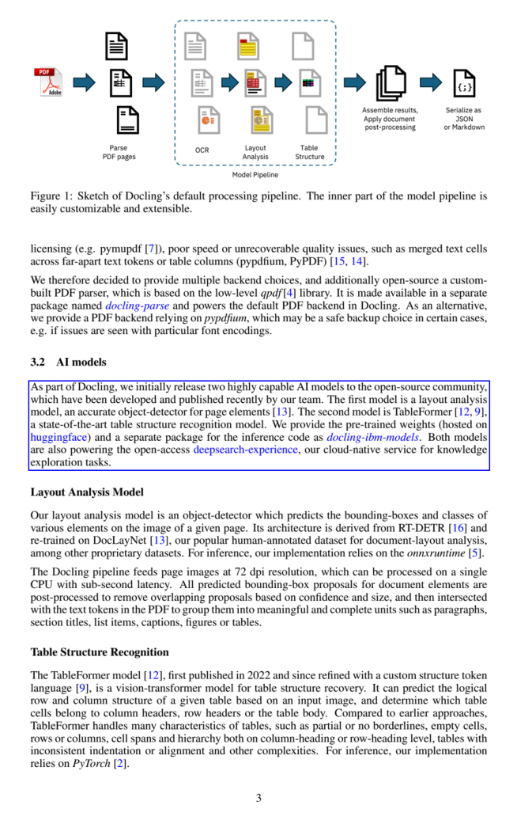
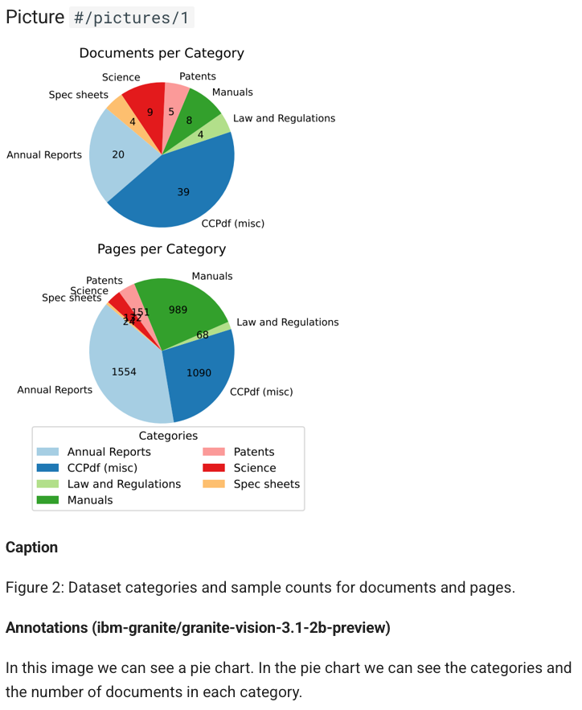

In this space, you can explore numerous Docling application recipes & end-to-end workflows!

Here some of our picks to get you started:

- 🔀 conversion examples ranging from [simple conversion to Markdown](./minimal.py) and export of [figures](./export_figures.py) & [tables](./export_tables.py), to [VLM](./minimal_vlm_pipeline.py) and [audio](./minimal_asr_pipeline.py) pipelines
- 💬 various RAG examples, e.g. based on [LangChain](./rag_langchain.ipynb), [LlamaIndex](./rag_llamaindex.ipynb), or [Haystack](./rag_haystack.ipynb), including [visual grounding](./visual_grounding.ipynb), and using different vector stores like [Milvus](./rag_milvus.ipynb), [Weaviate](./rag_weaviate.ipynb), or [Qdrant](./retrieval_qdrant.ipynb)
- examples for ✍️ [serialization](./serialization.ipynb) and ✂️ [chunking](./hybrid_chunking.ipynb), including [user-defined customizations](./advanced_chunking_and_serialization.ipynb)
- 🖼️ [picture annotations](./pictures_description.ipynb) and [enrichments](./enrich_doclingdocument.py)

👈 ... and there is much more: explore all the examples using the navigation menu on the side

    

        Visual grounding
        

        
    

    

        Picture annotations
        

        
    

